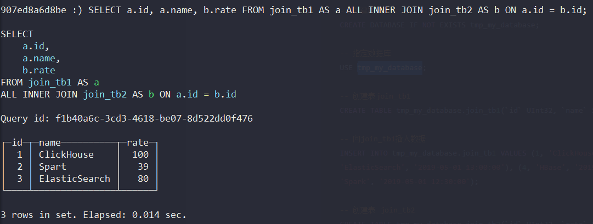
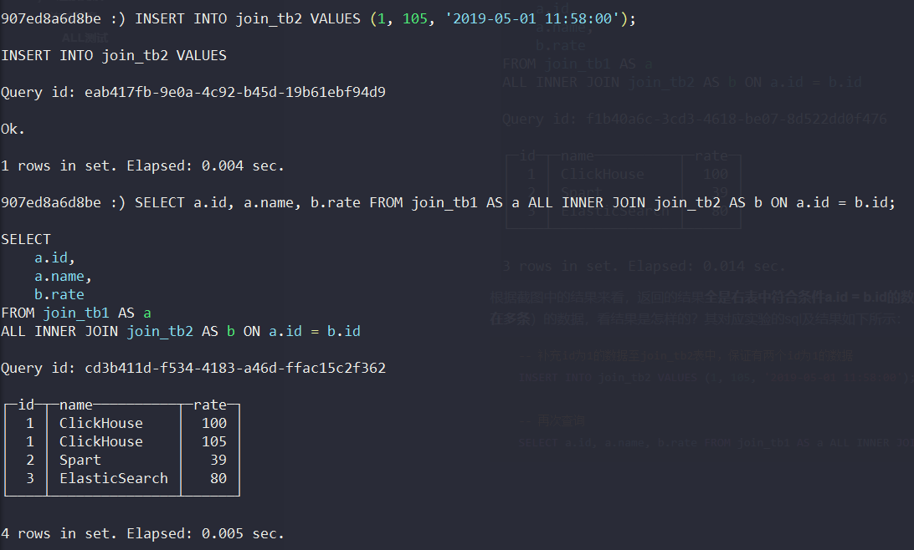
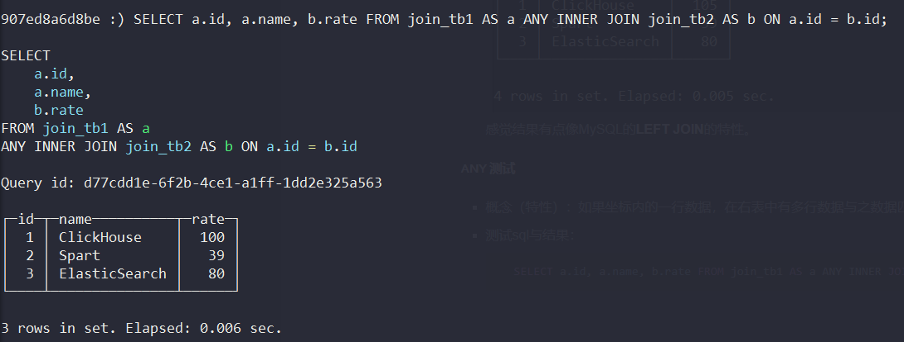
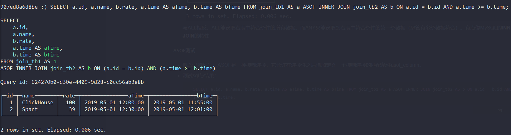
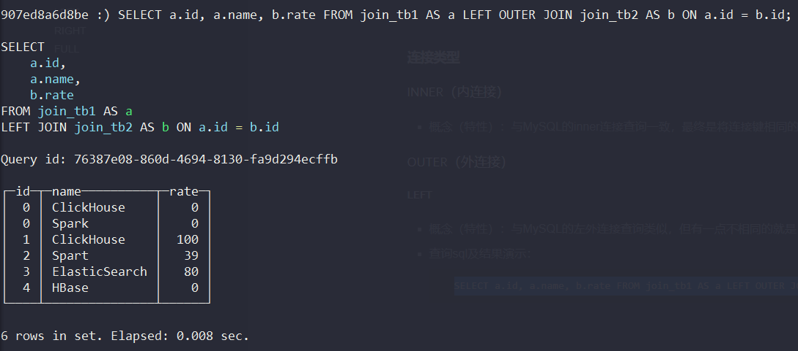
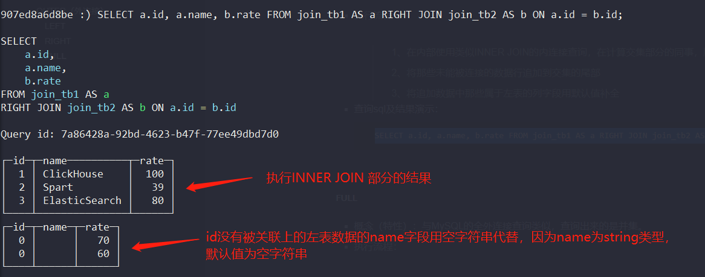
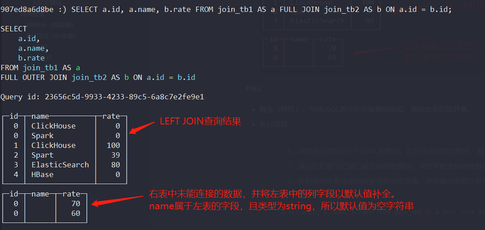

# 相关总结

## 使用jdbc链接clickhouse时，报Code: 81, e.displayText() = DB::Exception: Database tmp_my_database doesn't exist (version 20.11.4.13 (official build))的错误
* 解决方案：需要先创建tmp_my_database数据库，再使用jdbc链接。

* 在clickhouse命令行中执行如下命令创建数据库语句：
    ```shell script
    CREATE DATABASE IF NOT EXISTS tmp_my_database;
    ```
    
* 同时，可以使用如下语句删除数据库：

    ```shell
    DROP DATABASE IF EXISTS tmp_my_database;
    ```

    

## 建表语句解析
* 建表语句：
    ```shell script
        CREATE TABLE tmp_my_database.user
        (
            `id` String,
            `userName` String,
            `aliasName` String,
            `createTime` DateTime
        )
        ENGINE = MergeTree()
        PARTITION BY toYYYYMMDD(createTime)
        ORDER BY (userName)
        PRIMARY KEY (id)
    ```
    
    将在tmp_my_database数据库中创建user表，其中包含id、userName、aliasName、createTime四个字段，其中使用到的引擎为**合并树（最常用的一个）**，按照createTime进行分区，分区内的数据排序规则默认使用userName进行排序（**ps：后续如果可能有多个排序规则的话，可以都填写到order by里面，这样可以提高排序的查询效率。假设修改成 ORDER BY (userName, aliasName)，那么最终在每个分区中先按照userName排序，如果userName相同，再使用aliasName排序**）。指定了id为主键，最终会根据id字段生成一级索引，用于加速表查询。
    
## 关于使用jdbc操作clickhouse建议
* 在clickhouse中，不建议每次直接插入一条数据。在每次插入数据时，clickhouse内部为了让查询变得更快，内部都会做一些额外处理（比如：MergeTree引擎的表需要合并数据），而这些额外处理是非常耗时的，clickhouse的insert操作的qps只能达到千级。因此，不建议直接insert数据
* 在clickhouse中，不建议使用update和delete操作。首先，在clickhouse中，update和delete操作都是alter语句的变种，与我们传统的关系型数据库的update、delete语法不一致。其次，因为它是alter语句的变种，所以在clickhouse中执行update和delete操作比较耗性能。最后，如果实在要使用clickhouse的update和delete语句时，不能直接使用mybatis-plus提供的updateById和update api，因为他们底层的语法都不一致，会报错，如果实在要用，则可以在xml中编写clickhouse识别的update和delete语句，同时还有一个关注点就是：**分区键和主键不能被更新，如果涉及到这两个字段的更新的话，clickhouse会报错**

## 外部存储引擎 - kafka引擎

* 外部存储引擎：直接从其他的存储系统读取数据，比如从HDFS\MySQL\Kafka等等。这种表引擎只负责元数据管理和数据查询，而它们自身通常并不负责数据的写入，数据文件直接由外部系统提供。

* kafka外部引擎：

  ```txt
  默认情况下，kafka表引擎每间隔500毫秒会拉取一次数据，时间由stream_poll_timeout_ms参数控制，默认是500毫秒。
  数据首先会被放入缓存，在时机成熟的时候，缓存数据会被刷新到数据表。
  触发kafka表引擎刷新缓存的条件有两个，当满足其中的任意一个时，便会触发刷新动作：
  1、当一个数据块完成写入的时候（一个数据块的大小有kafka_max_block_size参数控制），默认情况下kafka_max_block_size=max_block_size=65536
  2、等待间隔超过7500毫秒，由stream_flush_interval_ms参数控制，默认为7500ms。
  ```

* 使用kafka外部引擎

  ```txt
  可以定义这么一张表：
  CREATE TABLE kafka_test(
    id UInt32,
    code String,
    name String
  ) ENGINE = Kafka()
  SETTINGS
    kafka_broker_list = 'localhost:9092',
    kafka_topic_list = 'sales-queue',
    kafka_group_name = 'chgroup',
    kafka_format = 'JSONEachRow'
    
  这表示，只要kafka的sales-queue的topic有数据接入，那么就会clickhouse就会把这个数据保存到kafka_test表中。
  只要我们直接查询kafka_test表数据就能看到kafka推送的数据了。但是，当你再次查询数据时，你会发现kafka_test表的数据
  不存在了。这是因为kafka表引擎在执行查询之后就会删除表内的数据。因此，我们可以使用如下正确的方式来使用kafka引擎。
  ```

* 正确打开方式：

  > 1. 首先，我们需要创建kafka数据表A，它充当的角色是一条数据管道，负责拉取kafka中的数据
  >
  >    ```shell
  >    ## 创建一张Kafka引擎的表，充当数据管道
  >    CREATE TABLE kafka_test(
  >      id UInt32,
  >      code String,
  >      name String
  >    ) ENGINE = Kafka()
  >    SETTINGS
  >      kafka_broker_list = 'localhost:9092',
  >      kafka_topic_list = 'sales-queue',
  >      kafka_group_name = 'chgroup',
  >      kafka_format = 'JSONEachRow'
  >    ```
  >
  > 2. 其次，我们要创建一张任意引擎（通常是MergeTree）的数据表B，它从当的角色是面向终端用户的查询库
  >
  >    ```shell
  >    ## 创建一张面向用户的终端表，这里使用MergeTree表引擎：
  >    CREATE TABLE kafka_table(
  >      id UInt32,
  >      code String,
  >      name String
  >    ) ENGINE = MergeTree()
  >    ORDER BY id
  >    ```
  >
  > 3. 最后，我们要使用一张物化视图C，它负责将表A的数据实时同步到表B\
  >
  >    ```shell
  >    # 创建一张物化视图，用于将数据从kafka_queue同步到kafka_table:
  >    CREATE MATERIALIZED VIEW consumer TO kafka_table AS SELECT id, code, name FROM kafka_test
  >    ```

  完成上述3个操作后，最终我们可以将kafka的数据保存到kafka_table表中，也不会存在查询一次数据就丢失的情况了。详细步骤可看**com.eugene.sumarry.clickhouse.ClickhouseKafkaEngineTest**单元测试类，测试步骤：
  
  ```txt
  1、启动com.eugene.sumarry.clickhouse.ClickhouseKafkaEngineTest#test单元测试
  2、启动com.eugene.sumarry.clickhouse.ClickhouseKafkaEngineTest#sendMsg单元测试，向kafka发送消息
  ```
  
  几个注意事项：
  
  1. 需要保证clickhouse服务器能访问到kafka服务器
  2. mybatis中要使用$符号获取参数，使用#获取不到参数

## MergeTree引擎原理

* 创建方式语法：

  ```shell
  CREATE TABLE [IS NOT EXISTS] [db_name].table_name(
      name1 [type] [DEFAULT|MATERIALIZED|ALIAS express],
      name2 [type] [DEFAULT|MATERIALIZED|ALIAS express],
      ...
  ) ENGINE = MergeTree()
  [PARTITION BY express]
  [ORDER BY express]
  [PRIMARY KEY express]
  [SAMPLE BY express]
  [SETTINGS name=value, .....]
  ```

* 参数解析：

  > 1. PARTITION BY [选填]：分区键，用于指定表数据以何种标准进行分区。分区的字段可以为多个列字段。如果没有填写，clickhouse将会生成一个名为all的分区。合理的使用数据分区，可以减少查询时数据文件的扫描范围。
  >
  > 2. ORDER BY [必填]：排序键，用于指定在一个数据片段内，数据以何种标准排序。默认情况下主键(PRIMARY KEY)与排序键相同。排序键也可以为多个列字段。在多个列字段的情况下， 优先使用第一个列字段排序，如果第一个列字段相同再使用第二个列字段，以此类推。
  >
  > 3. PAIMARY KEY [选填]：主键，声明后会依照主键字段生成一级索引，用于加速表查询。默认情况下，主键与排序键相同，所以通常直接使用ORDER BY 代为指定主键，无需刻意通过PRIMARY KEY 声明。所以在一般情况下，在单个数据片段内，数据与一级索引以相同的规则升序排序。与其他数据库不同，**MergeTee主键允许存在重复数据**
  >
  > 4. SAMPLE BY [选填]：抽样表达式，用于生命数据以何种标准进行采样。如果使用了此配置项，那么在主键的配置中也需要声明同样的表达式，例如：
  >
  >    ```shell
  >    .....
  >    ) ENGINE = MergeTree()
  >    ORDER BY (ConterId, EventDate, intHash32(UserID))
  >    SAMPLE BY intHash32(UserID)
  >    ```
  >
  >    抽样表达式需要配置SAMPLE子查询使用，这项功能对于选取抽样数据十分有用。
  >
  > 5. SETTINGS index_granularity [选填]：index_granularity对于mergeTree而言是一项非常重要的参数，它表示索引的粒度，默认值为8192。也就是说，MergeTree的索引在默认情况下，每间隔8192行数据才生产一条索引，其具体声明方式如下所示：
  >
  >    ```shell
  >    ...
  >    ) Engine = MergeTree()
  >    SETTINGS index_granularity = 8192;
  >    ```
  >
  >    通常情况下不会修改此参数

## join连接查询

* 目前clickhouse支持的join语句如下表两个部分组成（连接精度 + join类型）所示：

  | 连接精度 | join类型           | 备注     |
  | -------- | ------------------ | -------- |
  |          | LEFT JOIN          | 外连接   |
  | ALL      | RIGHT JOIN         | 外连接   |
  | ANY      | FULL [OURTER] JOIN | 外连接   |
  | ASOF     | INNER JOIN         | 内连接   |
  |          | CROSS JOIN         | 交叉连接 |

  其中，连接精度和join类型可以任意组合，即可以有15种选择。

### join连接测试

* 数据准备

  分别在clickhosue命令行客户端中，执行如下sql语句，创建三张表并插入对应的数据：

  ```sql
  -- 创建数据库
  CREATE DATABASE IF NOT EXISTS tmp_my_database;
  
  -- 指定数据库
  USE tmp_my_database;
  
  -- 创建表join_tb1
  CREATE TABLE tmp_my_database.join_tb1(`id` UInt32, `name` String, `time` DateTime) ENGINE = MergeTree() ORDER BY (id) PRIMARY KEY (id);
  
  -- 向join_tb1插入数据 (id传入的是null，最终会用UInt32的默认值0填充)
  INSERT INTO tmp_my_database.join_tb1 VALUES (1, 'ClickHouse', '2019-05-01 12:00:00'), (2, 'Spart', '2019-05-01 12:30:00'), (3, 'ElasticSearch', '2019-05-01 13:00:00'), (4, 'HBase', '2019-05-01 13:30:00'), (NULL, 'ClickHouse', '2019-05-01 12:00:00'), (NULL, 'Spark', '2019-05-01 12:30:00');
  
  -- 创建表 join_tb2
  CREATE TABLE tmp_my_database.join_tb2(`id` UInt32, `rate` UInt32, `time` DateTime) ENGINE = MergeTree() ORDER BY (id) PRIMARY KEY (id);
      
  -- 向join_tb2插入数据
  INSERT INTO tmp_my_database.join_tb2 VALUES (1, 100, '2019-05-01 11:55:00'), (2, 39, '2019-05-01 12:01:00'), (3, 80, '2019-05-01 13:10:00'), (5, 70, '2019-05-01 14:00:00'), (6, 60, '2019-05-01 13:50:00');
  
  -- 创建表 join_tb3
  CREATE TABLE tmp_my_database.join_tb3 (`id` UInt32, `star` UInt32) ENGINE = MergeTree() ORDER BY (id) PRIMARY KEY (id);
      
  -- 向join_tb3插入数据
  INSERT INTO tmp_my_database.join_tb3 VALUES (1, 1000), (2, 900), (3, 80), (5, 70), (6, 60);
  ```

#### 连接精度

##### ALL测试

* **概念（特性）**：如果左表内的一行数据，在右表中有多行数据与之连接匹配，则返回右表中全部连接的数据，而判断连接匹配的依据是左表与右表内的数据，基于连接建（JOIN KEY）的取值完全相等，等同于left.key = right.key

* 测试sql与结果：

  ```sql
  SELECT a.id, a.name, b.rate FROM join_tb1 AS a ALL INNER JOIN join_tb2 AS b ON a.id = b.id;
  ```

  

  根据截图中的结果来看，返回的结果**全是右表中符合条件a.id = b.id的数据**，可以做个实验，若join_tb2中存在两个id为1（**clickhouse允许主键相同的数据存在多条**）的数据，看结果是怎样的？其对应实验的sql及结果如下所示：

  ```SQL
  -- 补充id为1的数据至join_tb2表中，保证有两个id为1的数据
  INSERT INTO join_tb2 VALUES (1, 105, '2019-05-01 11:58:00');
  
  -- 再次查询
  SELECT a.id, a.name, b.rate FROM join_tb1 AS a ALL INNER JOIN join_tb2 AS b ON a.id = b.id;
  ```

  

  感觉结果有点像MySQL的**LEFT JOIN**的特性。

##### ANY 测试

* 概念（特性）：**如果坐标内的一行数据，在右表中有多行数据与之数据匹配，则仅返回右表中第一行连接的数据。**

* 测试sql与结果：

  ```sql
  SELECT a.id, a.name, b.rate FROM join_tb1 AS a ANY INNER JOIN join_tb2 AS b ON a.id = b.id;
  ```

  

  与ALL相反，ALL能获取右表中符合条件的所有数据。而ANY只能获取到右表中符合条件的第一条数据（尽管有多条数据符合）。有点像MySQL的**INNER JOIN**的特性

##### ASOF测试

* 概念（特性）：ASOF是一种模糊连接，它允许在连接件之后追加定义一个模糊连接的匹配条件asof_column。

* 测试sql与结果：

  ```sql
  SELECT a.id, a.name, b.rate, a.time AS aTime, b.time AS bTime FROM join_tb1 AS a ASOF INNER JOIN join_tb2 AS b ON a.id = b.id AND a.time >= b.time;
  ```

  

  由结果可知，asof后面除了有寻常的连接键以外，还多出了一个条件a.time >= b.time。 这就与MySQL一样，外连接之后，还可以用where关键字对连接后的数据做一次筛选。ASOF支持使用**USING**的简写形式，USING后生命的最后一个字段会被自动转换成asof_column模糊连接条件。例如，上面的ASOF测试sql用USING简写模式改版后，会变成下面这个样子：

  ```sql
  SELECT a.id, a.name, b.rate, a.time AS aTime, b.time AS bTime FROM join_tb1 AS a ASOF INNER JOIN join_tb2 AS b USING(id, time);
  ```

  用USING关键字改版后的查询结果与未改版之前**完全一致！**，但asof_column有两点需要注意：

  1. asof_column 必须是整形、浮点型和日期型这类有序序列的数据类型。（因此，使用String类型的字段作为asof_column，会报错。其报错的内容为：**Code: 403. DB::Exception: Received from localhost:9000. DB::Exception: No inequality in ASOF JOIN ON section..**，我这里测试时，clickhouse安装在本机，所以上面提示的是localhost:9000）
  2. asof_column不能是数据表内的唯一字段，换言之，连接键（JOIN KEY）和asof_column不能是同一个字段


### 连接类型

#### INNER（内连接）

* 概念（特性）：与MySQL的inner连接查询一致，最终是将连接键相同的数据都筛选出来，即交集。

#### OUTER（外连接）

##### LEFT

* 概念（特性）：与MySQL的左外连接查询类似，但有一点不相同的就是，当右表中没有找到连接的行，**则会采用相应字段数据类型的默认值填充**

* 查询sql及结果演示：

  ```sql
  SELECT a.id, a.name, b.rate FROM join_tb1 AS a LEFT OUTER JOIN join_tb2 AS b ON a.id = b.id;
  ```

  

  因为右表（join_tb2）中的rate类型为UInt32，且左表（join_tb1）的id不包含3和4，因此，会用默认值0来填充rate。**通过上述查询语句可知，右表中没有包含id为0和id为4的数据。**

##### RIGHT

* 概念（特性）：与MySQL的右外连接查询类似。然后与clickhouse的左外连接类似，以右表为主，**左表中不存在的数据则以对应数据类型的默认值填充**

* 执行流程：

  > 1、在内部使用类似INNER JOIN的内连接查询，在计算交集部分的同事，顺带记录右表中那些未能被连接的数据行。
  >
  > 2、将那些未能被连接的数据行追加到交集的尾部
  >
  > 3、将追加数据中那些属于左表的列字段用默认值补全

* 查询sql及结果演示：

  ```sql
  SELECT a.id, a.name, b.rate FROM join_tb1 AS a RIGHT JOIN join_tb2 AS b ON a.id = b.id;
  ```

  

##### FULL

* 概念（特性）：与MySQL的全外连接查询类似，查询出来的是并集。

* 执行流程：

  > 1、内部进行类似**LEFT JOIN** 的查询，在左外连接的过程中，顺带记录右表中已经被连接的数据行
  >
  > 2、通过在右表中记录已被连接的数据行，得到未被连接的数据行
  >
  > 3、将右表中未被连接的数据追加至结果集，**并将那些属于左表中的列字段以默认值补全**

* 查询sql及结果演示：

  ```sql
   SELECT a.id, a.name, b.rate FROM join_tb1 AS a FULL JOIN join_tb2 AS b ON a.id = b.id;
  ```

  